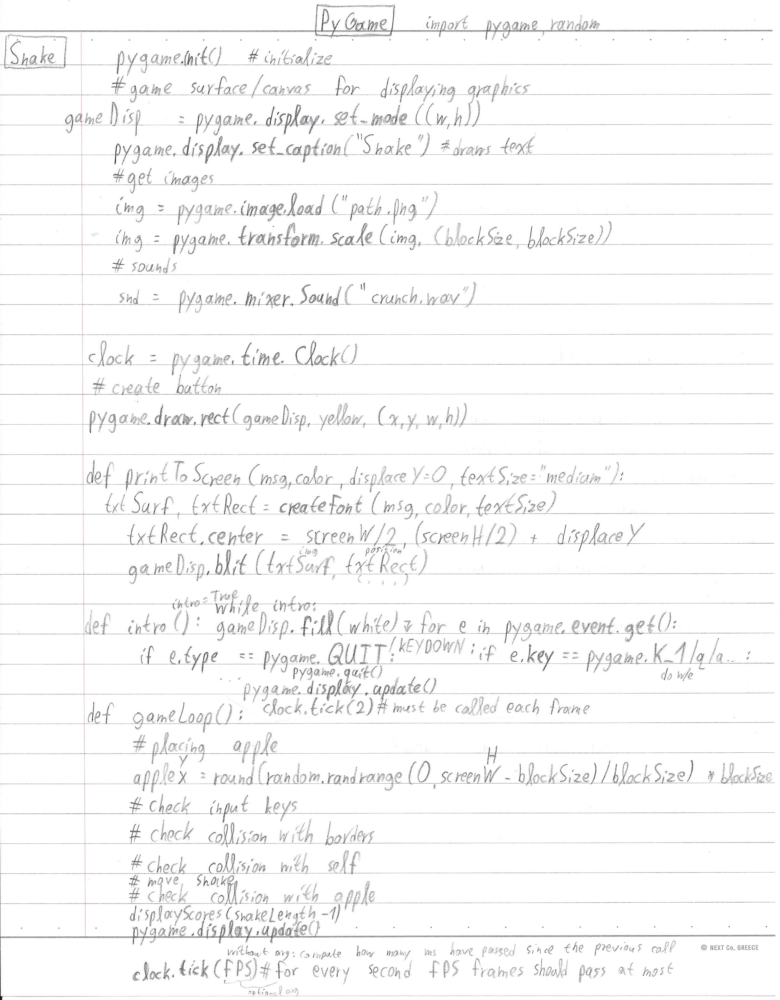
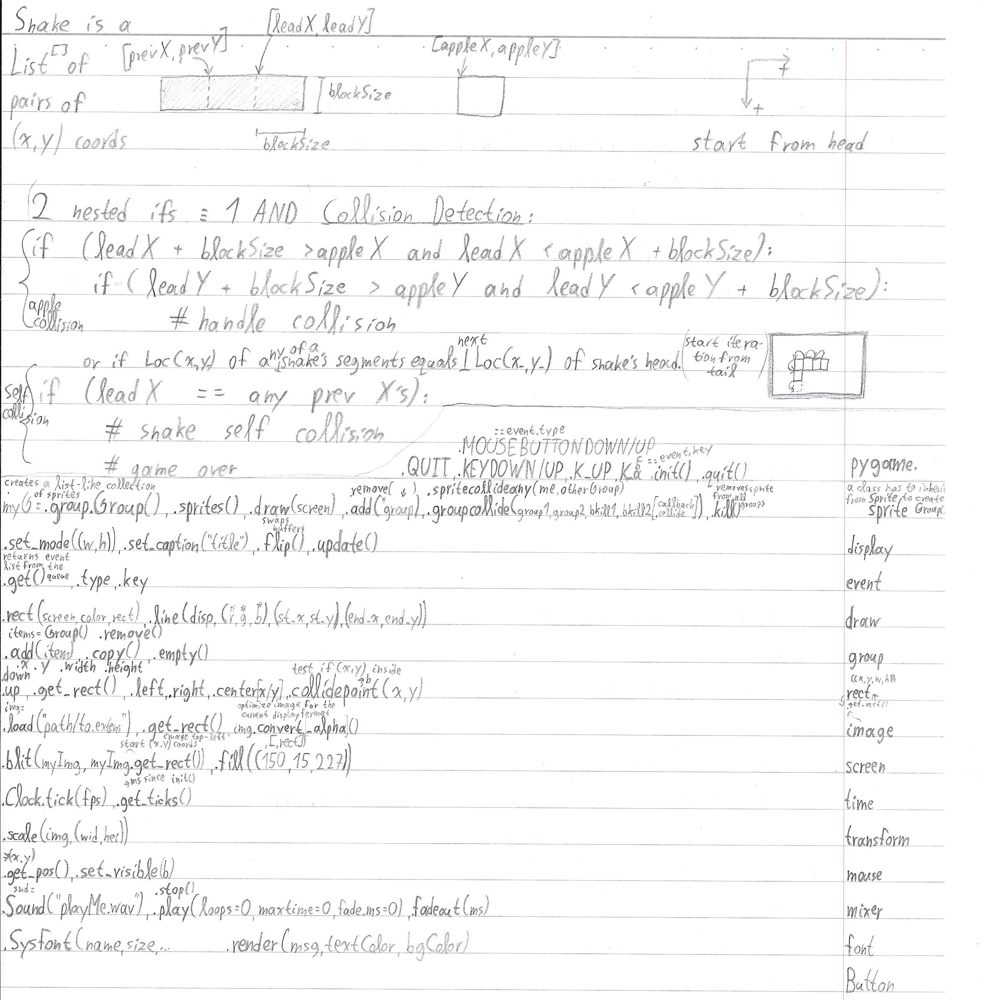

<h1 align="center">
	<a href="https://github.com/KeyC0de/SnakeApplesken">Snake Applesken</a>
</h1>

I had to do my own take of the classic Snake game I played back in the day on Nokia 3310 and Sony Ericsson W810i.
Enjoy the nostalgia induced experience.

I hereby give you my notes. If you want some implementation help on how I went about to do this: 

	

	

Comes with an executable which you can install too for funzies. 
Made with CXFreeze and Inno Setup.

# Contribute

Please submit any bugs you find through GitHub repository 'Issues' page with details describing how to replicate the problem. If you liked it or you learned something new give it a star, clone it, laugh at it, contribute to it whatever. I appreciate all of it. Enjoy.

# License

Distributed under the GNU GPL V3 License. See "GNU GPL license.txt" for more information.

# Contact

email: *nik.lazkey@gmail.com* 
website: *www.keyc0de.net*

# Acknowledgements

The image graphics I sketched myself primarily with GIMP free image software. 
- crunch.wav sound effect from freesound.org (keyword "crunch") 
- Cloister Black Font is free from Dieter Steffmann at https://www.1001freefonts.com/cloister-black.font
